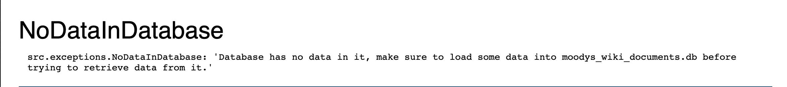

# Paulo Azoia - Wiki Project Backend

## Table of Contents

- [Client requirements](#client-requirements)
- [Project planning](./documentation/projectPlan.md#project-planning)
- [Database Design](./documentation/databaseDesignPlan.md#database-design)
- [Technologies](#technologies)
- [How to run app](#how-to-run-app)
- [Testing the API endpoints](#testing-the-api-endpoints)
- [Testing the API endpoints Error handling](#testing-the-api-endpoints-error-handling)
- [Project Status](#project-status)

## Client requirements

> Wiki Project Backend

We’d like you to create the backend for a wiki, like Wikipedia. With the following requirements:

1. A wiki is a collection of documents
2. Documents are lumps of plain text. No graphics, attachments, or formatting
3. Each document is uniquely identified by a title that is a maximum of 50 characters in
   length. This title does not change for the life of a document
4. A document can have multiple revisions, as it is updated over time. We store all
   historical revisions of a document
5. We should be able to view the document as it was at any point in time. I.e. we can use
   any timestamp to fetch a revision e.g. If we have a document at time 1pm and time 3pm, then sending a timestamp of 2pm should return the document as it was at time 1pm.

---

> ### Deliverable:
>
> 🚀 Your task is to implement a JSON api with the following endpoints: 🚀

```
GET /documents
```

> 🚀 This should return a list of available titles.

```
GET /documents/<title>
```

> 🚀 This should return a list of available revisions for a document.

```
GET /documents/<title>/<timestamp>
```

> 🚀 This should return the document as it was at that timestamp.

```
GET /documents/<title>/latest
```

> 🚀 This should return the current latest version of the document.

```
POST /documents/<title>
```

> 🚀 This allows users to post a new revision of a document. It should receive JSON in the form: {content: ‘new content...’}.

---

> ### Application notes

- I choose to use SQLite3 for the database for this project. My reasoning to use SQLite3 was that it is a light weight database, and as this is a project that is not going to demand too much from the database or hold any sensitive data I believe SQLite3 is sufficient. It also makes reviewing and testing the tech test easier as the database gets created on initialising the flask server.

---

## Technologies

- Python - [Python 3.11](https://www.python.org/)
- Pytest
- Flask
- SQLite3

---

## How to run app

> It's good practice to work on a virtual environment with it's own dependencies and packages.

1 - To create a virtual environment on your machine follow the commands below:

```
$ python -m venv venv
```

2 - Activate the newly created environment:

```
$ source venv/bin/activate
```

You should see the env_name now on your terminal like in the shown example

```
(venv) computer:~/
```

### **Dependencies**

> To install all dependencies saved in the requirements.txt file in your virtual environment run the command below:

```
$ pip install -r requirements.txt
```

> After installing dependencies run the code below to make sure the app is using dependencies installed in virtual environment:

```
$ deactivate && source venv/bin/activate
```

### **Pytest**

> Run the following command in your command line to run all the tests in the project:

```
$ pytest
```

or if want a more detailed result

```
$ pytest -v
```

### **Flask**

> Run the following command in your command line to start the flask server:  
> Make sure you are in the root folder of the project

```
$ python server.py
```

> Visit http://localhost:8080 et Voila, the app is running. 🎉🎉

---

## You can test the API endpoints following the links below:

### **_Testing the API endpoints_**

> With flask server running (`$ python server.py`), follow the links below and see the returned values.

- [Returns all titles available in DB](http://127.0.0.1:8080/documents)

```
http://127.0.0.1:8080/documents
```

- [Returns all document revisions for a specified title](http://127.0.0.1:8080/documents/Earth)

```
http://127.0.0.1:8080/documents/Earth
```

- [Returns the document for "Earth" that was created on "2023-03-22 14:20:00.00"](http://127.0.0.1:8080/documents/Earth/2023-03-22%2014:29:30.00)

```
http://127.0.0.1:8080/documents/Earth/2023-03-22%2014:29:30.00
```

- [Returns the document for "Earth" that was created on "2023-03-22 14:30:00.00"](http://127.0.0.1:8080/documents/Earth/2023-03-22%2014:50:00.00)

```
http://127.0.0.1:8080/documents/Earth/2023-03-22%2014:50:00.00
```

- [Returns the latest version of a document for a given title](http://127.0.0.1:8080/documents/Earth/latest)

```
http://127.0.0.1:8080/documents/Earth/latest
```

- Run the command below on your terminal to add a new document revision to a title.
  - With this command please make sure to have an exact match of the title (case sensitive) as it is saved in the DB to add a new document revision to this title.
  - If title does not exist on DB, it'll return the `TitleNotFound` exception.

```
curl -d '{"content": "added with curl"}' -H "Content-Type: application/json" -X POST http://localhost:8080/documents/Earth
```

- After running visit [All docs for "Our values"](http://127.0.0.1:8080/documents/Earth) and there should be a new revision similar to the one below.

```
[
   "Earth",
   "2050-03-04 12:00:00.000000",
   "added with curl"
]
```

---

### **_Testing the API endpoints Error handling_**

- Running query `http://127.0.0.1:8080/documents` on an empty database will raise the `NoDataInDatabase` exception as shown in the image below.



- [Running query `http://127.0.0.1:8080/documents/<title>` returns 'TitleNotFound' exception if provided a title that is not in the DB](http://127.0.0.1:8080/documents/Random%20title)

```
http://127.0.0.1:8080/documents/Random%20title
```

- [Running query `http://127.0.0.1:8080/documents/<title>/<timestamp>` returns 'NoDocumentCreatedAtTimestamp' exception if there's no document revisions with the timestamp or earlier](http://127.0.0.1:8080/documents/Earth/2023-02-22%2014:29:30.00)

```
http://127.0.0.1:8080/documents/Earth/2023-02-22%2014:29:30.00
```

- [Running query `http://127.0.0.1:8080/documents/<title>/<timestamp>` returns 'TitleNotFound' exception if provided a title that is not in the DB](http://127.0.0.1:8080/documents/Random%20title/2023-03-22%2014:29:30.00)

```
http://127.0.0.1:8080/documents/Random%20title/2023-03-22%2014:29:30.00
```

- [Running query `http://127.0.0.1:8080/documents/<title>/latest` returns 'TitleNotFound' exception if provided a title that is not in the DB](http://127.0.0.1:8080/documents/Random%20title/latest)

```
http://127.0.0.1:8080/documents/Random%20title/latest
```

- When trying to save a title to our DB that is longer that 50 chars, we get the message below.

```
raise TitleTooLongError(f"Title: '{document_title}' Title is too long, max limit of 50 characters")
src.exceptions.TitleTooLongError: "Title: 'This is a very long title, not good for our database so we don't accept it' Title is too long, max limit of 50 characters"
```

- Run the command below on the terminal, this will raise the `TitleNotFound` exception.

```
curl -d '{"content": "added with curl"}' -H "Content-Type: application/json" -X POST http://localhost:8080/documents/Random%20title
```

- You can see the exception message where you have your flask server running.

```
"Title: 'Random title' not found, please check the provided title is correct. Please note that the tile is case sensitive and it needs to match exactly the title stored in the database."
```

---

## Project Status

> To Do's

> Done

- ✅ Add edge case to `post_new_document_revision`
  - If a user tries to add unchanged content return `NoChangesDetected` exception

**_Implement JSON api endpoints:_**

- Return a list of available titles.

  - (`GET /documents`)
  - ✅ add route to server
  - ✅ add document_store_actions_management file with function returning endpoint requirements
  - ✅ add tests to test functions return the right values
  - ✅ add test to test function raises Exceptions
  - ✅ add testing api links to README

- Return a list of available revisions for a document.

  - (`GET /documents/<title>`)
  - ✅ add route to server
  - ✅ add document_store_actions_management function returning endpoint requirements
  - ✅ add tests to test functions return the right values
  - ✅ add test to test function raises Exceptions
  - ✅ add testing api links to README

- Returns the document as it was at that timestamp.

  - (`GET /documents/<title>/<timestamp>`)
  - ✅ add route to server
  - ✅ add document_store_actions_management function returning endpoint requirements
  - ✅ add tests to test functions return the right values
  - ✅ add test to test function raises Exceptions
  - ✅ add testing api links to README

- Returns the current latest version of the document.

  - (`GET /documents/<title>/latest`)
  - ✅ add route to server
  - ✅ add document_store_actions_management function returning endpoint requirements
  - ✅ add tests to test functions return the right values
  - ✅ add test to test function raises Exceptions
  - ✅ add testing api links to README

- This allows users to post a new revision of a document. It should receive JSON in the form: {content: ‘new content...’}.

  - (`POST /documents/<title>`)
  - ✅ add post method route on server
  - ✅ add testing api links to README

**_SQLite database_**

_Database setup_

- ✅ Create `wiki_documents_db` database
- ✅ Create `titles`, `documents_metadata` and `documents_data` tables following the Database design plan.

_Loading dummy data into database_

- ✅ Extract data from `dummy_data.json`
- ✅ Save data into respective `wiki_documents_db` tables and rows.
- ✅ Save more than 1 doc into a title:
  - ✅ document with its own uuid, but the same title id as in title table

**_Flask server_**

- ✅ Create flask server that returns "Welcome to My wiki docs"
- ✅ Check that server is running in http://localhost:8080

**_Setup_**

- ✅ Create virtual environment
- ✅ Activate virtual environment
- ✅ install pytest
- ✅ install flask
- ✅ save dependencies to requirements file

**_Dummy data for documents_**

- ✅ Create with some text to load into DB

**_Project Set up_**

- project set up
- All the documentation files
- README.md file
- Dummy_data_for_documents
